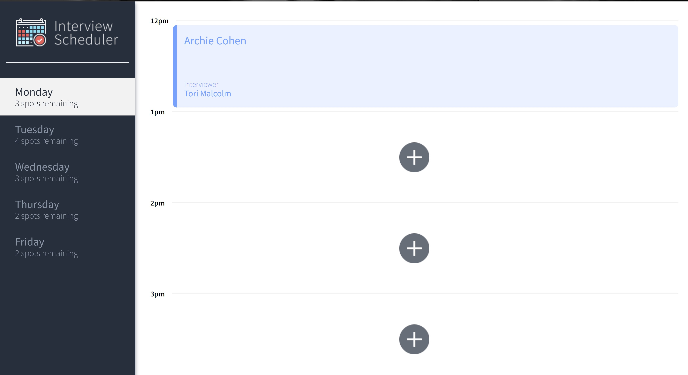
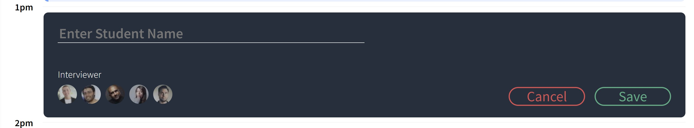
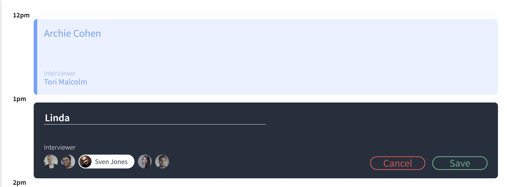
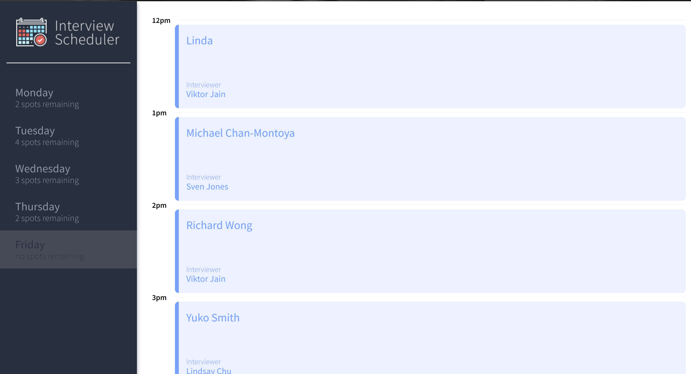

# Interview Scheduler

Interview Scheduler is a web app built using React


# TECH STACK #

## Languages, Frameworks & Database ##


## Testing ##


## Others


## Final Product










## Setup

Install dependencies with `npm install`.

## Running Webpack Development Server

```sh
npm start
```

## Running Jest Test Framework

```sh
npm test
```

## Running Storybook Visual Testbed

```sh
npm run storybook
```

## Running Cypress End to End test

```sh
npm run cypress
```

